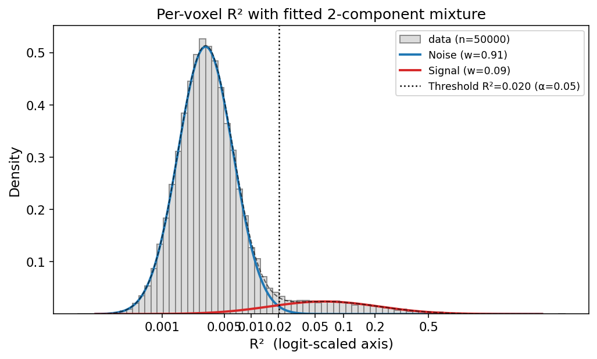
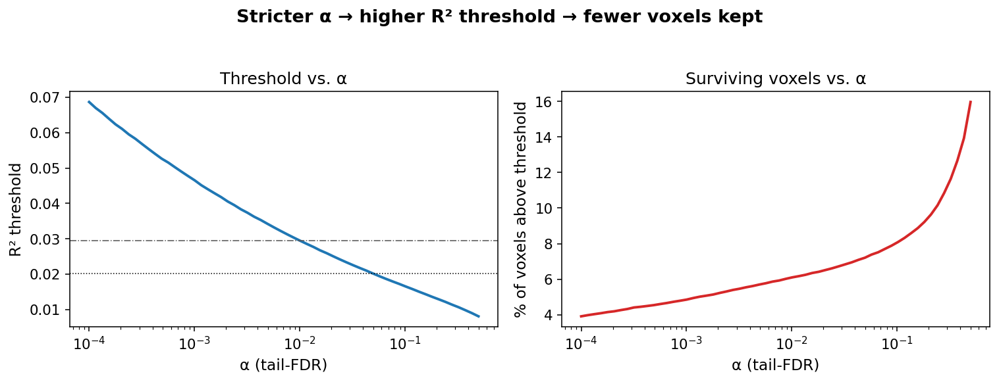
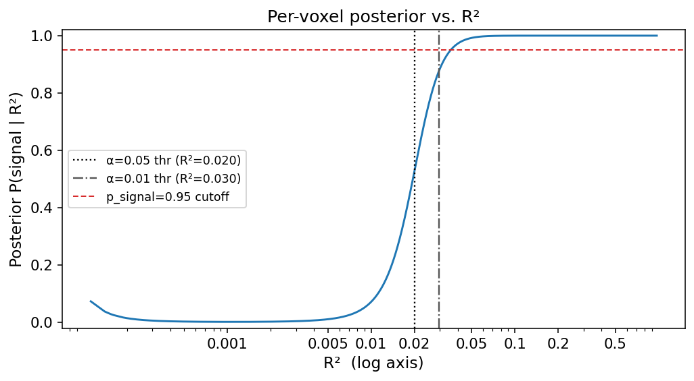
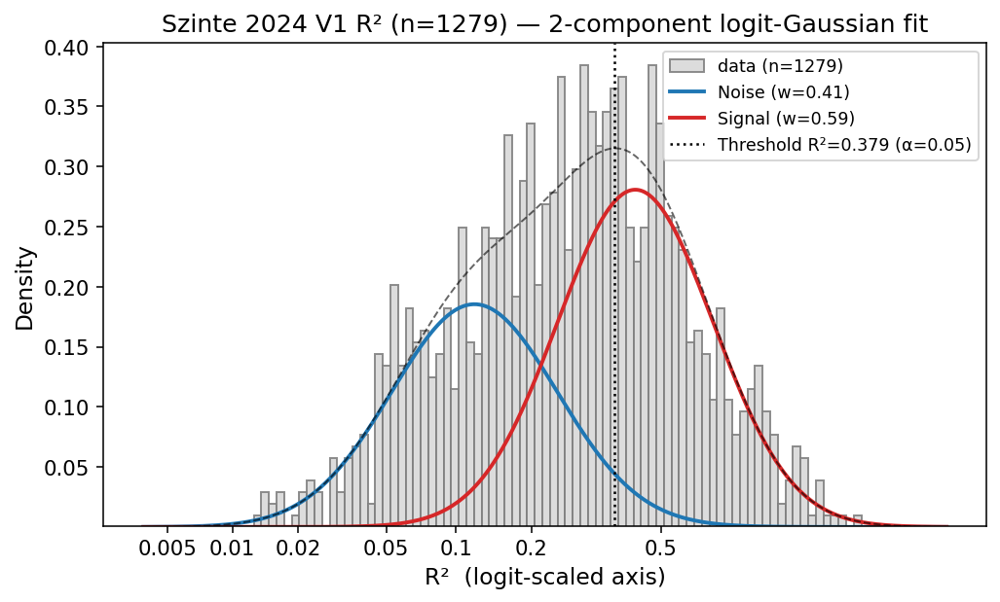

============================================
Lesson 8: R² thresholding via mixture FDR
============================================

After fitting an encoding model voxel-by-voxel, one practical question is
*which voxels actually carry stimulus-driven signal?* A naive cutoff like
"keep R² > 0.1" is arbitrary and tied to neither the noise distribution
nor the multiple-comparison cost. ``braincoder`` provides a small
2-component mixture toolkit on the per-voxel R² distribution that yields
calibrated per-voxel posteriors and tail-FDR thresholds.

The idea, in one paragraph
~~~~~~~~~~~~~~~~~~~~~~~~~~~

Per-voxel R² values from a fitted encoding model are a *mixture*: most
voxels carry only noise (R² scatters near zero from finite-sample
overfitting), and a minority carry real stimulus-driven signal (R² lifts
into a heavy right tail). If we fit a 2-component Gaussian mixture on
:math:`\\mathrm{logit}(R^2)`, we recover two Gaussians:

- **Noise**: low mean, narrow — the chance-fit population
- **Signal**: higher mean, wider tail — the real-signal population

From this fit we can compute (a) a calibrated per-voxel posterior
:math:`P(\\text{signal} \\mid R^2)` and (b) a tail-FDR R² threshold at
any α level. The logit transform is what makes this work: on raw R²,
both components live on a bounded [0,1] support and the noise mode
sits right at the boundary, which makes naive Beta-mixture EM unstable.
On :math:`\\mathrm{logit}(R^2)` everything lives on ℝ, the noise spike
becomes a clean Gaussian, and the signal tail stays Gaussian-shaped.

         (red) Gaussian components and the α=0.05 tail-FDR threshold.

   Diagnostic plot from :func:`~braincoder.utils.stats.plot_r2_mixture`.
   The grey histogram is the empirical per-voxel R² distribution (logit
   x-axis, log y-axis). The blue and red curves are the noise and
   signal component PDFs from a 2-component Gaussian mixture on
   :math:`\\mathrm{logit}(R^2)`. The dotted vertical line marks the
   tail-FDR R² threshold at α=0.05.

Workflow
~~~~~~~~

The pipeline has four steps. Each is one call.

Step 1 — Fit the mixture
^^^^^^^^^^^^^^^^^^^^^^^^

Given an array of per-voxel R² values (any 1D shape), one call returns
the fit parameters::

    import numpy as np
    from braincoder.utils.stats import fit_r2_mixture

    r2 = ...  # shape (n_voxels,), values in [0, 1]
    fit = fit_r2_mixture(r2)

    print(f"noise:  μ_R² = {fit['noise_mean_r2']:.4f}  w = {fit['noise_weight']:.2f}")
    print(f"signal: μ_R² = {fit['signal_mean_r2']:.4f}  w = {fit['signal_weight']:.2f}")

The function internally restricts to R² in (0, 0.99), works in
``logit(R²)`` space so the noise spike and signal tail are both
Gaussian-shaped, and runs 8 EM restarts by default. It raises
``ValueError`` if fewer than 50 valid voxels survive — too few for a
stable mixture.

Step 2 — Tail-FDR threshold
^^^^^^^^^^^^^^^^^^^^^^^^^^^

The tail-FDR R² threshold at level α is the smallest cutoff *t* such
that the expected false-discovery rate among voxels with R² ≥ *t*
is ≤ α:

.. math::

   \\mathrm{FDR}(t) \\;=\\;
   \\frac{w_n \\, P(R^2 > t \\mid \\text{noise})}
        {w_n \\, P(R^2 > t \\mid \\text{noise}) +
         w_s \\, P(R^2 > t \\mid \\text{signal})}.

::

    from braincoder.utils.stats import r2_fdr_threshold

    thr = r2_fdr_threshold(fit, alpha=0.05)   # or pass r2 directly
    keep = (r2 >= thr) & np.isfinite(r2)
    print(f"α=0.05 threshold: R² ≥ {thr:.4f}, keeps {keep.sum()} voxels")

Use a tighter α (0.01) for whole-brain visualization where you can
afford a strict per-voxel cost; α=0.05 is fine for per-ROI fits. The
figure below shows how the threshold and surviving-voxel count move
with α:

         Right panel: percent of voxels kept falls correspondingly.

   How α controls the R² threshold (left) and the surviving voxel
   count (right). Both panels share the log-α x-axis.

Step 3 — Per-voxel posterior
^^^^^^^^^^^^^^^^^^^^^^^^^^^^

The per-voxel posterior :math:`P(\\text{signal} \\mid R^2)` is often
the more useful quantity than the threshold itself — it lets you grade
voxels by confidence rather than hard-thresholding::

    from braincoder.utils.stats import posterior_p_signal

    p_sig = posterior_p_signal(r2, fit)        # shape (n_voxels,)
    confident = p_sig >= 0.95                  # 95%-posterior cutoff

The two cutoffs are related: at the α=0.05 tail-FDR threshold the
local posterior is around 0.94, and the α=0.01 threshold corresponds
to a local posterior near 0.99. The posterior view scales smoothly
down to 0; the FDR view is a hard cut.

         0.5 around the noise-signal crossover and 0.95 well above the
         α=0.05 tail-FDR threshold.

   Per-voxel posterior :math:`P(\\text{signal} \\mid R^2)` from the
   same fit, as a function of the voxel's R². The two vertical lines
   mark the α=0.05 and α=0.01 tail-FDR thresholds; the horizontal
   dashed line marks the ``p_signal ≥ 0.95`` cutoff.

Step 4 — End-to-end convenience
^^^^^^^^^^^^^^^^^^^^^^^^^^^^^^^

The three steps above are wrapped in a single call::

    from braincoder.utils.stats import fit_and_classify

    out = fit_and_classify(r2, alpha=0.05)
    fit, p_sig, thr = out['fit'], out['p_signal'], out['r2_threshold']

It safely handles the "too few voxels" case by returning ``fit=None``
and ``p_sig`` all-NaN; check ``out['reason']`` to see why.

What about K=3 mixtures?
~~~~~~~~~~~~~~~~~~~~~~~~

Tested empirically on a 30-subject 7T PRF dataset (retsupp): BIC strongly
prefers K=2 over K=3 (ΔBIC ≳ 1500). When the data is allowed to split
into 3 components, the third component splits *the noise*, not the
signal — so you don't pick up "physiological vs. thermal noise vs.
signal" structure in the marginal R² distribution. If you need that
separation, condition on tissue (use a gray-matter or retinotopic-ROI
mask) before fitting.

Picking the voxel set
~~~~~~~~~~~~~~~~~~~~~

The fit is sensitive to *which* voxels you feed it:

- **Per-ROI** (V1, V2, …): tight, well-separated mixtures; thresholds
  are honest per-ROI FDR cutoffs.
- **Whole-brain / GM**: the noise component absorbs both thermal and
  physiological noise (they overlap in the marginal); the signal
  component captures a wide, low-R² shoulder. Threshold is correct
  but visually permissive (α=0.05 retains ~5% of voxels). Tighten to
  α=0.01 or use ``posterior_p_signal ≥ 0.95`` for visualization.

Common pathologies to watch for in :func:`plot_r2_mixture`:

- Signal PDF lying flat or nearly flat → likely converged to a
  near-uniform Beta in disguise; refit on a more homogeneous voxel set
  (per-ROI rather than whole-brain), or use the F+Beta variant.
- ``r2_fdr_threshold`` returns ``np.inf`` → the mixture is too
  degenerate to compute a finite threshold; switch to a per-ROI fit
  or to ``fit_r2_f_beta_mixture`` (model-anchored noise).

For pipelines that need a per-voxel threshold cached across subjects,
see the BIDS-aware wrappers in `retsupp
<https://github.com/Gilles86/retinotopic_supression>`__
(``retsupp.modeling.compute_r2_mixture``) which call into this module.

Worked example on real data
~~~~~~~~~~~~~~~~~~~~~~~~~~~

The same pipeline applied to the bundled Szinte 2024 V1 dataset
(``braincoder.utils.data.load_szinte2024``) — 1279 pre-fit V1 voxels
on the surface::

    from braincoder.utils.data import load_szinte2024
    from braincoder.utils.stats import fit_and_classify

    r2 = load_szinte2024()['r2'].dropna()
    out = fit_and_classify(r2.values, alpha=0.05)

This dataset is *already* filtered to high-signal V1 vertices (median
R²=0.29, no large near-zero spike), so the "noise" component here is
better understood as "weakly-tuned V1 voxels" rather than thermal
noise. The mixture still recovers a clean bimodal split:

         components in logit-R² space.

   Same diagnostic on real per-vertex V1 R² from
   :func:`~braincoder.utils.data.load_szinte2024`. Two well-separated
   populations: weakly-tuned V1 (blue, μ_R²≈0.12) and strongly-tuned
   V1 (red, μ_R²≈0.43). α=0.05 tail-FDR threshold at R²≈0.38 selects
   the strongly-tuned subset for downstream decoding.

The takeaway is that the same machinery scales from a clean whole-brain
mixture (one noise + one signal) to a pre-filtered ROI mixture (two
populations of "signal"). What changes is the *interpretation* of the
two components; the math is identical.

Reproducing the figures
~~~~~~~~~~~~~~~~~~~~~~~

All figures on this page are generated by
``docs/tutorial/figures/r2_fdr/make_figures.py``. The first three use a
simulated mixture (90% noise + 10% signal, 50k voxels); the last uses
the bundled Szinte 2024 V1 data. Run that script from the repo root
to regenerate.
